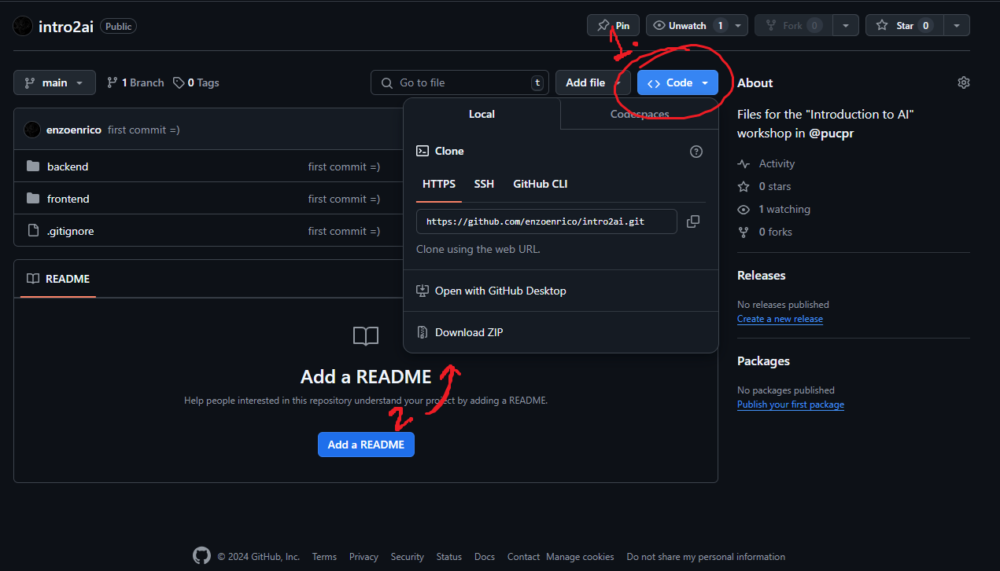

## Introdução à IA

Nesse workshop aprenderemos como integrar nossos dados a um modelo de IA, como criar uma API para utilizar nosso modelo e como acessar essa API através de um aplicativo React!

### Instalação e utilização
> Para poder rodar o projeto, é necessário **NodeJS** e **Python** instalados em sua máquina.

> É necessária uma licensa válida da OpenAI para utilizar o modelo GPT-4o. Para obter uma licensa, acesse https://platform.openai.com/account/api-keys e crie uma conta gratuita.

>É preciso verificar seu número de telefone para receber os créditos!


### Repositório
Clone o repositório atual em seu pc (https://github.com/enzoenrico/intro2ai) e o acesse por seu terminal

> Se preferir, baixe os arquivos do repositório através da interface web do Github

> Extraia o zip e o caminho extraído por seu terminal

### Backend
#### Instalação
> Acesse a pasta backend pelo terminal e instale as dependências do projeto com o comando: 

>**pip install -r requirements.txt**

> Crie um arquivo .env na pasta backend e adicione a variável OPENAI_API_KEY com o valor da sua chave de API da OpenAI

```env
OPENAI_API_KEY = "sua-chave-de-api-aqui"
```

#### Utilização
> Para rodar o backend, utilize o comando:

> **uvicorn api:app**

> e acesse a api pelo endereço http://localhost:8000

### Frontend
#### Instalação
> Acesse a pasta frontend pelo terminal e instale as dependências do projeto com o comando: 

>**npm install**

#### Utilização
> Para rodar o frontend, utilize o comando:

> **npm run dev**

> e acesse a api pelo endereço http://localhost:5173    